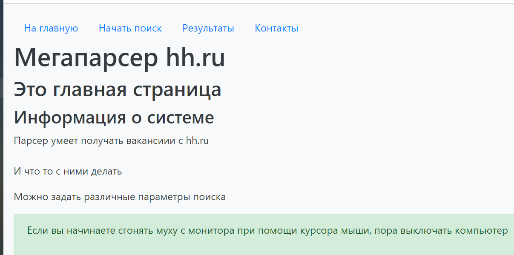
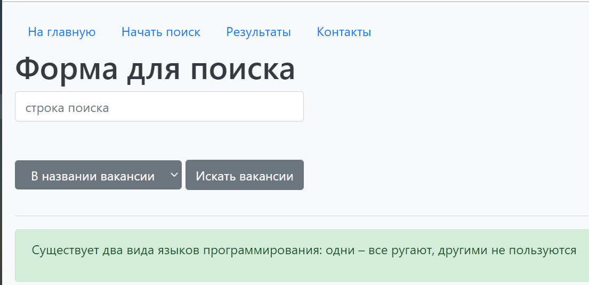
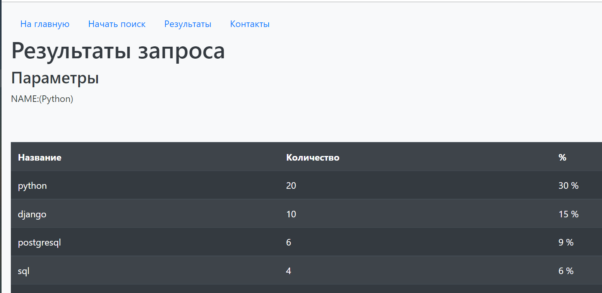
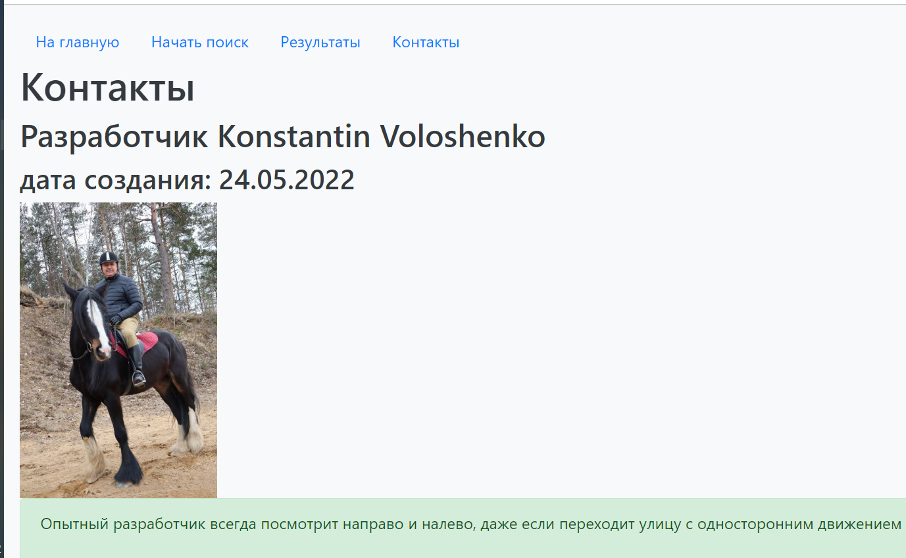

# PDD_16_hw
Python: Flask. MVC
# Web site on Flask for collecting skills from hh.ru
## Description
This site performs requests to hh.ru via api, gets vacancies for given search criteria, parses the response and analyzes the required skills.
## How to start
Run main.py
## Dependencies
Used module hhru.all_data
## Site structure
The site consists of four pages:
* index.html
* form.html
* results.html
* contacts.html

